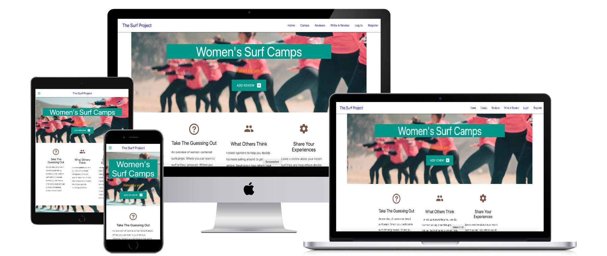
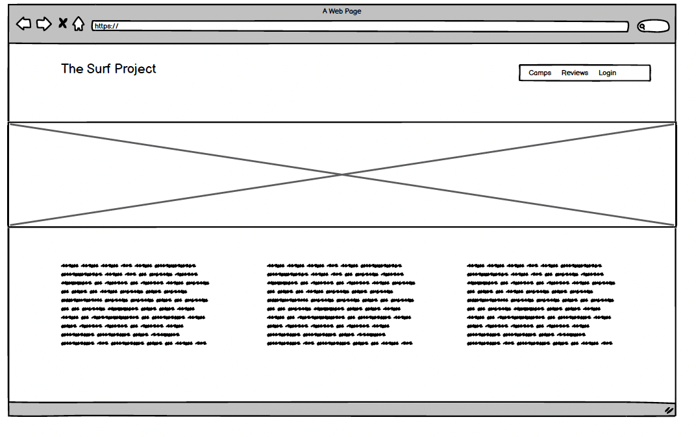
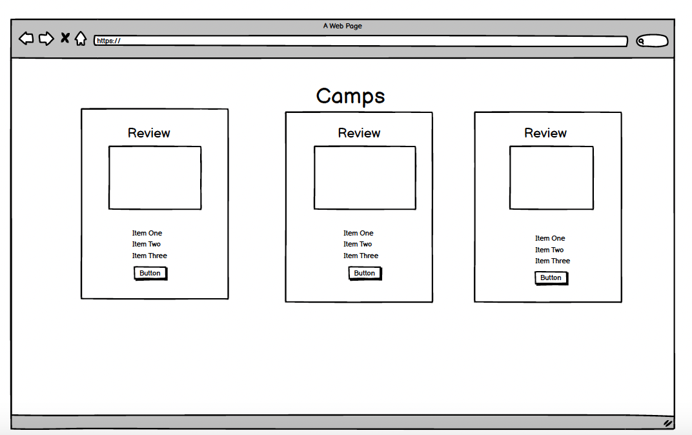

<h1 align="center">The Surf Project</h1>

An experience-sharing website where users can tell others about their stays at women's surf camps.

<h2 align="center"></h2>

## Wireframes

## User Experience (UX)

-   ### User stories

    -   #### First Time Visitor Goals

        1. As a First Time Visitor, I want to find new locations to go on holiday.
        2. As a First Time Visitor, I want to read about other people's experiences.
        3. As a First Time Visitor, I want to add my experiences to the website to share with others.

    -   #### Returning Visitor Goals

        1. As a Returning Visitor, I want to look for a specific camp I am interested in.
        2. As a Returning Visitor, I want to edit a review I previously submitted.

    -   #### Frequent User Goals
        1. As a Frequent User, I want to add new camps I have visited.
        2. As a Frequent User, I want to delete reviews I no longer find up-to-date.
        3. As a Frequent User, I want to add my own run surfcamp to the database so others can review.

## Features

-   Responsive on all device sizes

-   Interactive elements

## Technologies Used

### Languages Used

-   [HTML5](https://en.wikipedia.org/wiki/HTML5)
-   [CSS3](https://en.wikipedia.org/wiki/Cascading_Style_Sheets)
-   [Javascript](https://en.wikipedia.org/wiki/JavaScript)
-   [Python](https://en.wikipedia.org/wiki/Python_(programming_language))
-   [flask](https://flask.palletsprojects.com/en/2.2.x/)
-   [SQLAlchemy](https://www.sqlalchemy.org/)
-   [Pymongo](https://pymongo.readthedocs.io/en/stable/)

### Frameworks, Libraries & Programs Used

1. [Materialize](https://materializecss.com/getting-started.html)
    - Materialize template was used to assist with the responsiveness and styling of the website.
1. [Font Awesome:](https://fontawesome.com/)
    - Font Awesome was used on all pages throughout the website to add icons for aesthetic and UX purposes.
1. [Git](https://git-scm.com/)
    - Git was used for version control by utilizing the Gitpod terminal to commit to Git and Push to GitHub.
1. [GitHub:](https://github.com/)
    - GitHub is used to store the projects code after being pushed from Git.
1. [Creately](https://creately.com/)
    - Creately was used to design the database.
1. [MongoDB](https://www.mongodb.com/)
    - MongoDB was used to store the reviews in a non-relational database
1. [Heroku](https://www.heroku.com/)
    - Heroku was used to deploy the website

## Testing

The website was continually tested manually and with defensive coding included in the routes.py.

It was thoroughly tested on different devices for responsiveness.

### Known Bugs

When editing the review, the camp of the original review is no longer picked up and automatically selected.
This was not an issue when I ran the project solely with SQLAlchemy but became a bug when I switched to using MongoDB to store the reviews. No 

## Deployment

The project was deployed to Heroku and Github.

### GitHub Pages

This project was developed on Gitpod, committed to Git and pushed onto the [Github repository](https://github.com/StienBoodts/horizon-animatie-CI-MP2) using Bash. 

To deploy the website from the repository onto Github Pages the following steps were taken:

1. log into Github
2. from the list of repositories, choose **StienBoodts/horizon-animatie-CI-MP2**.
3. Navigate to **Settings** at the top of the repository.
4. Choose **Pages** from the menu on the left of the page.
5. In the Source Section, select **Branch: main** in the drop down menu.
6. Leave **/(root)** selected in the next drop down menu.
7. Press **Save**
8. The page will refresh and the **link to the deployed website** will appear at the top.

### Heroku 

To deploy the website from the repository onto Heroku the following steps were taken:

1. Set up required files: requirement.txt and Procfile
1. Push the created files to Github Repository
1. Log into Heroku
1. Click New -> Create New App
1. Choose Name and appropriate region and click create app
1. Navigate to the Resources tab
1. Search for Heroku Postgres and add it as an add-on
1. Click on Settings tab
1. Scroll down and click on 'Config Vars'
1. Add variables that are saved in env.py file
1. Under the Deploy tab, choose to deploy from Github repo
1. Search for the name of your repo and connect
1. Select enable automatic deploys
1. Select Deploy Branch
1. Click More drop down button and select Run Console
1. Next to heroku run type 'Python3' to access the interpreter
Type the following commands onto the console:
    - from surfproject import db
    - db.create_all()
    - exit()
1. Finally, click on 'Open App' button.

## Credits

### Code

-   Code Institute Walkthrough Projects
-  [Materialize](https://materializecss.com/getting-started.html)

### Media

-   All Images were created by the developer or given permission to be used.
